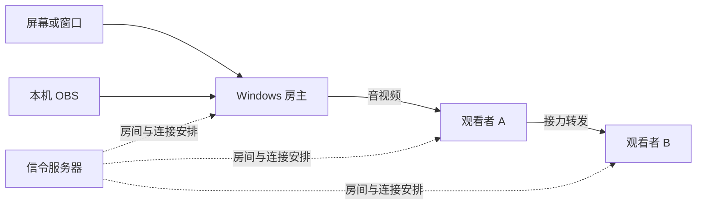
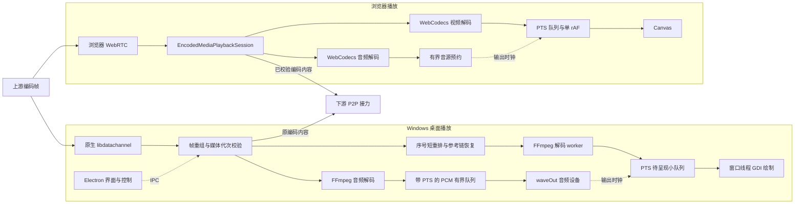

# VDS 项目现状报告

## 2026-10-09 差分更新修复（1.7.5 已发布）

1.7.4 的 `disableDifferentialDownload=true` 是全量下载的直接原因；此前未认证旧地图与安装包不匹配、同进程坏缓存不能重下、准备发布会覆盖旧地图的问题也已定位。1.7.5 将清单签名扩展到当前地图的路径、大小和 SHA512；本地基线保存原始签名清单及地图，先核验旧版本、安装包与地图，再进行严格 HTTPS 单 Range 重组并复验完整安装包。缺失基线或失败自动全量，取消不回退；同进程坏缓存自动清理重下，旧版本地图不再从本地重建版本复制。安装前异步保存新基线，首次启动也可核验 NSIS 当前安装包建立基线。1.7.3/1.7.4 的内置开关无法由服务端改变，必须先全量升级一次到 1.7.5；后续具备有效基线的更新可差分。

最终发布前/后检查通过：桌面 245/245、Web 151/151、静态响应 7/7、原生 CTest 24/24，架构、服务端 core/revival/reconnect、依赖审计和打包启动/正常退出通过。实际官方 1.7.4 与最终 1.7.5 EXE 的隔离签名 HTTPS 实测：7 次 Range，仅传 995,123 字节安装包数据，加两份地图共 1,471,641 字节；未请求全包，重组大小/完整 SHA512 一致。使用修复后的客户端代码及临时测试签名，未执行安装，也不代表已安装的旧 1.7.4 能直接差分。1.7.4 原校验代码接受新的正式签名清单和全量包，迁移兼容通过。安装包 235,382,490 字节，SHA256 `46be13efcf4b70d22187f9af9869c1dd9ce7fce80a6b50599b1b258c051a1585`；41 份桌面/renderer 源文件与 ASAR 一致，native 哈希与 1.7.4 相同。

源码 `cba4753` 已推送，`v1.7.5` 标签对应同一源码；[正式 Release](https://github.com/M4rkzzz/VDS/releases/tag/v1.7.5) 四资产大小/SHA256 与最终构建一致。默认 HTTPS 更新源已切到 1.7.5，原始签名、签入的地图哈希、安装包头尾 Range 通过，1.7.4 的真实 NsisUpdater 已识别更新。使用生产公钥、真实公网清单和隔离缓存验证了 1.7.5 自动建立已认证基线；未操作用户安装或用户缓存。NAS 仍运行原六位房号镜像/API 1.7.3，没有重启容器，旧版本安装包和地图、四个容器 ID/启动时间、证书与 FRP 不变。旧清单、签名和逐文件哈希在 `/vol1/1000/docker/vds/ops/release-1.7.5-before`。下方差分禁用及“尚未修复”的记录属于 1.7.3/1.7.4 历史阶段；现行链路以上方 1.7.5 为准。

## 2026-10-09 WGC 与房主会话恢复修复（1.7.4 已发布）

修复采集源在 WinRT 初始化前调用 IsSupported、对象跨线程关闭时错误反初始化 apartment 的生命周期问题，改为按线程初始化和退出。原生预览与发送端共同使用此路径。重新选源先停止旧会话；启动 RPC 失败也释放部分分配的会话，回滚失败保留占用状态以便下次重试清理。OBS 每个异步阶段隔离取消，旧失败与音频结果不再清掉新分享；WGC 读帧异常转换为错误，关闭异常不再导致采集线程退出。停止房主同时释放 WASAPI 采集和音频发送队列，避免持续 MEDIA_SESSION_ACTIVE。

最终发布前、发布后检查通过：桌面 222/222、Web 151/151、静态响应 7/7、原生 CTest 24/24，服务端 core/revival/reconnect、架构与依赖审计通过。真实自建窗口跨线程关闭、重建和帧回读 8 轮通过；实际进程音频 captureActive=true 时停止房主后能切换新所有者。1.7.4 包含 40 份桌面/renderer 源文件，与源码一致；安装包 235,379,496 字节，SHA256 `e991c41479a6ee2b44dea40f7bee5b175d938b53f6b8e7e7017b17d3ec5379a7`，离线签验、native 完整性及打包 IPC/启动/正常退出通过。尚不能据此断言用户的所有窗口、显卡和最小化场景均已验收。

修复源码 `197b3d5` 已推 GitHub master，`v1.7.4` 标签对应同一源码；[正式 Release](https://github.com/M4rkzzz/VDS/releases/tag/v1.7.4) 四资产大小及 SHA256 与本地完全一致。默认 HTTPS 更新源已切换为 1.7.4，原始清单签名、小文件哈希和安装包头尾 Range 验证通过，真实 NsisUpdater 已确认 1.7.3 可更新到 1.7.4。只更新发行资产和清单，NAS 信令仍运行 `vds-signaling:1.7.3-short-rooms`，API 仍为 1.7.3；全部四个容器 ID/启动时间、旧安装包与地图、证书和 FRP 不变。旧清单及更新哈希保存在 `/vol1/1000/docker/vds/ops/release-1.7.4-before`。没有操作用户正在运行的已安装 1.7.3，客户端需通过更新获取修复。

以下为 2026-10-08 的发布历史，当时工作区、本机已安装程序、GitHub 正式发布与线上/NAS 均为 1.7.3，已包含安全修复、效率优化、音频选择与房间恢复修复。VDS 是 Windows 房主与桌面、浏览器观看者之间的多人屏幕共享工具，支持观看者继续接力转发。保持纯 P2P、禁止 TURN、后台免管理令牌，没有新增 FPS、码率或运行时长限额；Windows 安装包仍无 Authenticode 签名，跨运营商与长时真实音画仍需实机验收。

## 2026-10-08 六位一次性房号热修（已上线）

线上新房号现为固定 6 位，从 `23456789ABCDEFGHJKLMNPQRSTUVWXYZ` 随机生成，仅对应当前活动房间，房间关闭或失效后旧码作废，不增加旧码兼容入口。生成时检查当前房间 Map，碰撞最多重新抽样 32 次；sessionToken 身份验证保持不变。Web 加入入口已补去除首尾空白与转大写。

仅服务端与 Web 已更新为镜像 `vds-signaling:1.7.3-short-rooms`，API 版本仍为 1.7.3；未发新桌面，已发布 v1.7.3 标签、四份资产和默认更新源内容保持原样，现有客户端无需重装。完整 check（Web 151/151、桌面 213/213、静态响应 7/7）及 core/revival/reconnect 通过；严格 TLS 公网六位建房、两观看者的直接/接力信令、恢复、伪造 token 拒绝与退出清理通过。另验证私房过期后旧码拒绝、新六位房重建及加入/清理；公网隐藏、可信内网 3010 可见且不泄漏 sessionToken。Web 两资产与本地一致，gzip/immutable、原更新签名/三个小文件哈希和安装包头尾 206 Range 通过；这些不是跨运营商真实媒体验收。

NAS 全部 updates 文件 SHA256、其他三个容器 ID/启动时间不变，证书与 FRP 未动。热修前源码、Web、compose 及旧镜像可用私密备份 `/vol1/1000/docker/vds/ops/room-code-6-before` 回滚。下方十二位房号及迁移验证属于 1.7.3 原始发布历史，不代表当前房号规则。

1.7.3 阶段更新链路历史复核（当前修复见 1.7.5 章节）：当时已发布 1.7.3 显式禁止差分，使用离线签名认证和全量下载；正常下载、篡改拒绝、取消重试及有效缓存已由真实 NsisUpdater 验证，含既有 40 项和临时 29 项回归。仍有待修项：坏包缓存后，同进程重试需要重启才能重新下载，篡改包仍被拒绝安装；本机缓存的 1.7.3 安装包与 1.7.2 blockmap 基线不配对，当前禁差分不受影响，恢复差分前需要绑定版本/哈希并认证地图、校验边界；发布准备脚本会用本地同版本重建地图覆盖 staging 的旧地图，需要保护正式旧发行地图。本轮线上旧地图保持原样，未修改已发布桌面或发布准备脚本，这些缺口尚未修复。

## 1.7.3 发布与部署

发布源码 `c4ebf0a` 已推送 GitHub master，`v1.7.3` 标签对应同一源码；[正式 Release](https://github.com/M4rkzzz/VDS/releases/tag/v1.7.3) 的安装包、blockmap、`latest.yml` 和 `latest.yml.sig` 四份资产大小与 digest 均与本地产物一致。默认 HTTPS 更新源已切换为 1.7.3，原始清单签名、三个小文件哈希与安装包头尾 Range 验证通过；旧 1.7.2 的真实 NsisUpdater 已识别新版本。

客户端先发布，随后构建并部署 NAS 镜像 `vds-signaling:1.7.3`，仅替换 VDS 容器，保留 compose 端口、3 秒房主宽限和 updates 只读挂载，其他三个容器的 ID/启动时间不变。公网版本、双后台 scope、Web 源文件一致性、gzip/缓存策略及严格 TLS 下的建房、加入、两跳信令、重连、伪造 token 拒绝、公开拓扑和退出清理通过；信令验证不等于真实跨网媒体验收。旧部署连同 updates 已私密备份至 `/vol1/1000/docker/vds/ops/release-1.7.3-before`，旧安装包保留，证书和 FRP 未改动。

内网 3000 的同套信令验证也通过；自有 12 位私房在公网 public-rooms 中隐藏、可信内网 3010 all-rooms 可见，两处不泄漏 sessionToken，主动离开后房间已删除。

## 1.7.3 音频选择与房间恢复修复（已发布）

“进程音频不识别”来自选择界面的发现时机与匹配条件：原已安装的 1.7.2 在弹窗显示时拿到 deferred 空音频列表，真正枚举发生在确认且弹窗隐藏之后；同时把窗口 PID 必须处于 active 音频列表当成可采集条件，误判静音窗口及由子进程发声的应用。实机音频库实际支持且已授权，2–3 个会话的枚举约 49–60 ms，问题不是新 IPC 校验拒绝。

1.7.3 已将音频发现提前到弹窗、选择和开关操作，显示加载或失败状态，并按弹窗代次缓存和隔离迟到结果。窗口可直接选 PID，复用已有 WASAPI 进程树采集；整屏由用户手选活跃音频进程，不强制混入系统声音。取消或切换来源后，旧异步结果不能继续发起分享。

“房间不存在”已在公网私有临时房、严格 TLS 下复现：房主断线约 3.35 秒后超过线上 3 秒宽限，旧 token 恢复返回 `session-not-found`，观看者加入返回 `room-not-found`；旧客户端只提示错误却保留失效房号。现在未确认的 create/join 重发原请求，不使用空 token resume；房主复用当前媒体重建房间，以服务端 ACK 的新真实房号更新界面；观看者清理失效状态并提示重新加入，停止与取消仍隔离旧恢复任务。取消刷新也会释放界面忙状态。

发布前公网 1.7.2 的协议兼容实测通过：严格 TLS 下仅使用自有私有临时房，旧房自然过期后旧 token 被拒绝，以原 manifest 重建得到新房号和新 token，旧码拒绝、新码加入及主动离开清理均正确，新 ACK 满足客户端校验。该次兼容测试没有推送媒体或修改线上服务，不代表公网真实媒体 P2P 已验收。

当前四份 package/lock 已同步 1.7.3，已完成的本轮验证：

- 完整 `npm run check` 与构建通过：Web 148/148、服务端静态响应 7/7、桌面 213/213；含音频选择 18 项和房间客户端/原生控制器/观看者共 62 项，以及取消刷新释放忙状态回归。本轮未改动或重编 native，沿用此前 CTest 23/23 的 runtime。
- 实际 SRT → native → Web 的 1080p60 B0 八阶段通过：稳态 10.018 秒呈现 588 帧（58.694 fps）、消费 462 AAC，新增视频丢弃 3、音频 0，无 warning 或 console error。恢复阶段会清理旧积压；这是本机短时合成回归，不代表真实 GPU、物理声卡长跑或跨运营商验收。
- 本地 `dist/VDS-Setup-1.7.3.exe` 为 235,378,402 字节，SHA256 `6B1F1D85038482A63E2764410CFED405D8B65971D6FBE4E691E0A1EF124D09F0`；`app.asar` 为 3,886,191 字节，40 个源文件与 ASAR 精确一致，清单离线签验及包范围检查通过。Koffi 仅 win32_x64，包内不含 Express/ws；native runtime SHA256 仍为 `AB6368C046AFD7DDAF0129F1D84DA760CB0D8F9F4D5B53B5BAA4448A7E1C35EA`。实际打包程序 1.7.3 / Electron 42.11.11 已通过 17 个采集目标枚举、音频平台、NAT 与正常退出检查，无测试进程残留。
- 实际打包界面的房间过期恢复通过：重建后服务端新房号与 UI/state 一致，当前 mediaSession 保持。真实 native 进程 loopback 专项只采集自有 ffplay 的零样本测试源，收到 47 包、22,560 帧，停止后计数稳定；无 renderer 异常或自有进程残留。此项证明进程音频采集链路，不代表进程音频编码或端到端播放已验收。
- 已原地更新 `C:\Program Files\VDS` 为 1.7.3，NSIS 退出码 0；安装后 EXE/ASAR/native 哈希与冻结验证包一致，5 个本轮 renderer 文件精确一致。已安装程序使用独立 profile 通过版本、包内 agent、IPC/音频平台/NAT 和正常退出检查，退出码 0、无残留，未启动用户会话。

以上 1.7.3 已完成发布与部署；下方本地 1.7.2 的测试与哈希均为此前记录，独立保留作基线，不是本轮发布资产。

## 2026-10-08 审计修复（已随 1.7.3 发布）

已修复原生异常分片、Annex-B 无界缓冲、慢下游发送积压、逐片事件输出与 FFmpeg 进程树关停；服务端拒绝身份碰撞、清洗信令、回收半开连接，公网后台只显示公开房间。桌面 IPC 增加来源和参数校验，桌面与 Web 握手可真正取消并重试，RPC/JSON 边界及日志轮转已补齐。Web 分片空闲积压和 CGNAT 等待判定同步修复。具体保护范围和未修改项见 [审计清单](CODE_AUDIT_FINDINGS.md)。

更新链新增离线 Ed25519 认证，私钥不交给更新服务器；客户端认证原始清单、安装包大小与 SHA512。它保护新版客户端，不等于 Authenticode，也无法追溯保护旧客户端的首次升级。Windows 采集驱动阻塞时的 WGC join 仍待采集进程隔离；没有用不安全线程分离绕过关闭。

新房号为 12 位，本轮已先发布支持 12 位输入的新桌面包，再更新服务端。旧 1.7.2 桌面的手动输入框只有 6 位，需升级至 1.7.3 才能手动加入新房；旧 6 位房间仍可加入。

此前安全修复轮（优化前）验证（2026-10-08，本地 1.7.2，未发布工作区）：

- 最终 `npm run check` 通过：Web 139/139、桌面 154/154，含 TypeScript、协议/帧/生命周期、架构、日志、服务端身份与重连回归；Web 构建及 Docker context 检查通过。根与 server 生产依赖审计均为 0，未因此宣称开发依赖全量审计为 0。
- 最终原生 Release、CTest 20/20 与 agent smoke 通过，CTest 83.46 秒。新增 AU 1065、RPC 65、关停 7、真实 Job 子孙进程 39 项检查通过；真实 SCTP 232 项检查覆盖恶意分片、反向媒体拒绝及 20 片仅一次状态通知。分片专项另含完整 2 MiB/171 片组装、预算释放和背压恢复。真实原生 60 fps 聚包测试 280 帧全部解码、261 帧 GDI 绘制，220 AAC 全部消费，压缩输入预算丢弃和参考链重置均为 0。
- Electron 42 真 WebCodecs 解码通过 H.264、AAC、Opus、8 kHz AAC 和带 PTS 间隙 AAC，画布色彩断言通过。实际 SRT → native → Web 的 1080p30 B2 与 1080p60 B0 八阶段均通过：加入、持续播放、退出重进、刷新、Web 二跳、同 peer 两次源重启及接力断开回退。30 fps 稳态 10.019 秒呈现 290 帧（28.945 fps）、消费 450 AAC，视频/音频无新增丢弃；60 fps 稳态 10.048 秒呈现 589 帧（58.619 fps）、消费 462 AAC，音频无新增丢弃、视频新增 1 次丢弃。两组没有 console error 或 warning；重连恢复阶段会丢旧积压，不是全程零丢弃。这是本机短时合成媒体验证，不代表跨运营商成功率、长时物理音画或性能增益。
- 更新真实性专用回归 26/26 通过，覆盖缺签名、篡改、真实 NSIS 事件继承、大小/哈希、无限 chunked、重定向和取消。另用真正 ElectronHttpExecutor + NsisUpdater 验证正常下载/100% 进度、错误大小、HTTP 跳转、无限响应和取消清理，5/5 通过；测试证书例外仅限本地地址及 fixture 指纹，生产 TLS 未改。
- 本地 NSIS 构建、离线清单签验及 40 个源码/静态文件与 ASAR 精确一致性通过；Agent/juice/datachannel 的 build/runtime/package 哈希一致。实际打包程序的 IPC/preload、原生能力、13 个采集目标枚举、音频平台、四 STUN/NAT 代次、关闭及正常退出通过，无测试进程残留。未执行安装向导。本地安装包仍使用 1.7.2 名称，只供本轮验证，不得覆盖线上同版本；大小 239,888,314 字节，SHA256 `C0E32F97D189BBC69F14E7117D8B4AC0C15A32A8B05E20721E05705557AF7FB3`，native runtime SHA256 `532816349C2FB175BC77533971C08CB2270ADE6AA3A4C2A1C63CBE51FC019CD4`。

## 2026-10-08 轻量效率优化（已随 1.7.3 发布）

此前效率优化轮使用本地 1.7.2，只减少既有热路径、打包和静态响应的重复工作；改动现已随 1.7.3 发布部署，不新增运行配额，媒体继续纯 P2P。以下数字保留为发布前验证基线。

- 音频 `audio-data` 诊断事件仅在已有 `VDS_VERBOSE_MEDIA_LOGS=1` 时构造和输出，正常编码与分发继续执行；就绪判断改读所需布尔状态，不为判断就绪复制完整快照。
- WGC 复用 CPU 缓冲，将已有的采样判断移到 GPU 回读之前；Web 播放端对单个 AU 的 NAL 只扫描一次，仅实际需要时生成 AVCC，小型参数集保存独立副本。relay 在锁外分析 NAL，取消逐订阅者的 `live_units` 整份复制，payload/cache/bootstrap 仍有现有复制。没有改成零拷贝或重写 GPU 管线。
- 桌面只打包当前 Windows 架构的 Koffi；根目录 Express/ws 改为开发依赖，独立服务端仍保留运行依赖。修正平台过滤覆盖主文件白名单的问题，新增真实 builder matcher 回归与发布时 ASAR 范围检查。停用差分后不再保留无用途的安装包缓存副本。Ninja 等单配置生成器未指定配置时默认 Release，原生测试继续保留。
- 服务端使用 compression 1.8.2 压缩适用文本；仅 Web 构建 hash 命名的 assets 使用一年 immutable，HTML、`latest.yml`、`latest.yml.sig` 禁止缓存，更新下载与 Range 不压缩。Docker 使用 `COPY --chown`，去掉递归 `RUN chown`。

此前效率优化轮验证（本地 1.7.2）：

- 最终完整 `npm run check` 通过：Web 148/148、桌面 163/163、服务端静态响应 7 项，含原有架构、日志、协议与生命周期检查；原生 CTest 23/23 通过，85.98 秒。
- 最终 Web 构建的实际 gzip 响应：JS 97,293 → 28,428 字节，CSS 7,045 → 2,247 字节。这是相应静态资源的传输字节数，不代表媒体、CPU 或 GPU 收益。
- 实际 SRT → native → Web 的 1080p30 B2、1080p60 B0 均通过八阶段恢复，没有 console error 或 warning。30 fps 稳态 10.069 秒呈现 291 帧（28.901 fps）、消费 457 AAC，视频和音频无新增丢弃；60 fps 稳态 10.048 秒呈现 586 帧（58.320 fps）、消费 461 AAC，视频新增 2 次丢弃、音频无新增丢弃。恢复阶段会清理旧积压，不是全程零丢弃；本机短时合成测试用于恢复回归，不作性能提升对照。
- 本轮安装包为 `dist/VDS-Setup-1.7.2.exe`，235,375,656 字节，比安全修复轮优化前的 239,888,314 字节少 4,512,658 字节（4.30 MiB，约 1.88%）。SHA256 为 `F045A6CB8C6D0B84E7B0971F70041D245AC343C1BBAFE87A977F7F3E1BB659C6`；离线清单签名与复验、40 个源码/静态文件与 ASAR 逐字节一致、三份 native 文件在 build/runtime/package 间一致均通过。native runtime SHA256 为 `AB6368C046AFD7DDAF0129F1D84DA760CB0D8F9F4D5B53B5BAA4448A7E1C35EA`。本地仍使用 1.7.2 名称，未覆盖线上同版本资产。
- `app.asar` 为 3,869,023 字节，减少 1,683,287 字节；`app.asar.unpacked` 为 9,674,917 字节、144 文件，减少 24,925,819 字节，两者合计减少 26,609,106 字节（25.38 MiB），不能等同于压缩后 NSIS 的 4.30 MiB 减量。Koffi 实际仅含 win32_x64，loader 字节不变、binding 哈希匹配，包内不含 Express/ws。实际打包 Electron 42.11.11 通过 IPC/preload、原生能力、16 个采集目标、音频平台、四 STUN/NAT 及正常关闭，无测试进程残留。未执行安装向导。

真实 WGC GPU、物理声卡长跑与跨运营商实机连通未纳入这次短测。房主改为单次共享编码、GPU 管线与 D3D 重构、CI 跨平台 logging 和大型报告归档均不纳入本轮，也未进行 LTCG 性能对照。

## 项目是什么

## 现有服务端恢复进度

2026-10-07 已恢复现有 NAS 上的 `vds-signaling` Docker 容器，部署本轮修复后的服务与完整 Web 产物，运行时更新为 Node 22.23.3 / Alpine 3.24。按用户要求，管理后台直接访问，无需管理令牌；房间会话身份验证仍保留。旧更新清单、安装包及历史 blockmap 的哈希全部保持一致。VDS 容器和对应 FRP 穿透已设置自动启动，其他容器未改动。

内网真实流程和公网严格 HTTPS/WSS 验证均通过建房、两个观看者的直接/接力拓扑、offer/answer/ICE 双向转发、观看者及房主断线恢复、后台免凭据读取拓扑、伪造房间会话令牌拒绝及退出清理。公网 502 和过期证书问题已解决。

原证书已于 2026-09-17 到期。本轮使用 PassNAT 提供的 DNS TXT 验证渠道签发并部署 Let’s Encrypt 新证书，有效期至 2027-01-05 20:16:17（北京时间）。保留原 FRP 路由和证书文件 ACL，重新加载代理后严格证书校验通过；临时挑战服务已停止。管理入口为 `https://boshan.s.3q.hair/admin`，Web 观看入口为 `https://boshan.s.3q.hair/vds_web/`。

已配置每天 04:17 的轻量 DNS 续期任务，剩余超过 21 天时不联网、不重启，进入窗口后复用既有 ACME 账户。NAS 离线自测、未到期检查和实际无操作运行通过；签发失败保留服务、安装后加载失败回滚证书的流程通过模拟验证。实际到期自动续期尚未发生。维护步骤见 [服务端维护说明](SERVER_OPERATIONS.md)。

## 项目是什么

VDS 是一套可自部署的多人屏幕共享工具。房主用 Windows 客户端共享整个屏幕、单个窗口，或接入本机 OBS 的画面；观看者通过房间码或公开房间列表，用桌面客户端或浏览器加入。适合局域网演示、远程排障、软件和游戏测试围观、OBS 预览分发。

它的主要特点是观看者可以继续把画面转发给其他观看者，分担房主的上传带宽。服务器只负责房间、信令和连接关系，不转发媒体。音视频通过客户端之间的 WebRTC DataChannel 传输；接力节点转发已经编码的帧，避免再次编码的开销。实际连接质量仍取决于网络、设备和浏览器能力。

典型链路如下，实际拓扑可以分支，浏览器能否承担转发由能力检测决定。



## 核心模块与职责

| 模块 | 位置 | 职责与技术 |
| --- | --- | --- |
| Windows 桌面客户端 | `desktop/`、`server/public/` | Electron 主进程和 preload 提供窗口、更新、原生进程桥接；renderer 负责界面、房间操作和媒体控制。 |
| 原生媒体引擎 | `media-agent/` | C++ 独立进程，负责 Windows Graphics Capture 采集、FFmpeg 编解码、libdatachannel 传输、音频、接力转发和原生显示窗口。 |
| 信令与管理服务 | `server/` | Node.js、Express、WebSocket 管理房间、重连和转发拓扑，提供公开房间列表、管理后台与桌面更新源。支持 Docker 部署。 |
| 浏览器观看端 | `vds_web/` | TypeScript、Vite、WebCodecs，负责加入房间、接收和解码画面、能力检测、诊断及符合条件的接力转发。 |
| 检查与发布工具 | `scripts/`、`tests/`、`docs/` | 架构边界检查、协议和生命周期回归、原生构建、桌面打包、发布校验及维护文档。 |

原生视频路径支持 H.264/H.265；原生房主音频使用 Opus，OBS 输入使用 AAC。OBS 通过本机 SRT/MPEG-TS 接入，默认地址为 `127.0.0.1`、端口为 `61080`。浏览器最终可用的编解码组合取决于平台探测结果。

仓库已经做过职责拆分，本轮继续小范围整理关键边界。当前维护难点集中在跨进程调用、异步取消、重复停启以及旧连接回调的归属；部分 renderer 仍由传统脚本和共享状态连接各个 controller。

## 播放端结构与本轮整理

桌面和浏览器共用编码帧协议，使用各自平台的解码与输出后端。Electron 负责界面、房间和原生控制；C++ 负责桌面实际播放。浏览器用 WebCodecs 解码和 Canvas 呈现。两端以源 PTS 决定显示时机，在有效音频启动后参照音频输出位置。



播放会话拥有帧重组、媒体源代次、短乱序和两个播放器的生命周期。`main.ts` 保留房间、信令、上游恢复和编码接力。退出或换源时清理旧解码器、队列、音源和时钟；迟到的旧回调不能复活播放，Web 换源保留已由用户手势解锁的 AudioContext。已校验编码内容的接力继续独立于本地显示丢帧和解码恢复。

| 边界 | 位置 | 当前职责 |
| --- | --- | --- |
| 连接与拓扑 | Web `main.ts`、`upstream-recovery.ts`，桌面 room/peer controller | 连接身份、加入取消、上游恢复与接力握手。 |
| 源时间与代次 | 原生 host clock、OBS ingest、frame timing；两端协议与 relay | 同一源共用 64 位微秒 PTS，v1 可选 `sourceEpoch` 隔离 retained peer 上的换源。下游每次绑定与上游换代生成新的输出代次，PTS、内容序号继续保留。 |
| Web 播放会话 | `vds_web/src/playback-session.ts`、`playback-policy.ts` | 帧重组、代次校验、按发送序号短重排、参考链恢复和统一清理。 |
| 原生视频 | `native_video_surface.cpp`、`native_playback_scheduler.h` | 解码和调度 worker 与窗口绘制分离；压缩队列随源帧率、250 ms 突发窗口和实际音频领先量伸缩，约 20 ms 缺口等待。失效参考链用配置和关键帧恢复。 |
| Web 视频 | `webcodecs-player.ts` | 分别计量待处理输入、codec 内部输出和待呈现画面；根据真实 B 帧重排量预留输出位置，单 rAF 按 PTS 绘制。manifest 的 `frameRate` 与 `fps` 均能传递源帧率，未声明时由实际帧间隔估计。 |
| 音频与输出时钟 | Web audio player；原生 audio session、playback、timing | 预约和 PCM 队列有界，跟踪实际输出位置，驱动视频；没有有效音频时钟时回退单调时钟。 |

待呈现画面保持小队列：原生通常 2 帧，Web 通常 2 帧、观察到 B 帧后通常 3 帧；按 BGRA 尺寸估算的 32 MiB 是软目标，4K 通常只保留 1 帧待呈现，合法的单幅大画面仍可播放。该目标不包含解码器、当前显示画面或 GDI backbuffer。原生尽量在硬件回读和颜色转换前丢弃迟到画面，并移交和复用显示缓冲；Web 及时关闭淘汰的 VideoFrame。待呈现队列满时先等待输出，不裁剪正常参考帧来腾位置。没有新画面时保持上一帧。

两端压缩输入容量随实际源帧率和音频输出进度调整，容纳约 250 ms 的正常聚包及音频领先量。原生压缩队列另计 32 MiB 内存预算和已经到期的 500 ms 陈旧输入，防止持续异常积压；不以固定帧数限制正常 60 fps 或更高帧率。源切换退役记录跟随接收会话生命周期保留，换源次数和刷新请求中的 peer 数量没有新增固定上限。

原生音频把 waveOut 实际采样位置映射到源 PTS，设备在途目标为 60 ms，软件与设备总积压目标为 120 ms 加用户延迟。已有 worker 按 AAC ADTS access unit 或短 PCMU 片段逐段解码，尚未到期的尾段留在原压缩块中，不一次性挤入 PCM。8 kHz AAC 单帧长达 128 ms 等合法格式可临时突破软件软目标，消费后恢复目标；已有 libswresample 转换非 48 kHz 双声道，正常格式直接输出。500 ms 清理只针对已经到期且输出设备确实没有继续前进的数据。Web 同样按完整合法音频单元的实际时长等待，不用 120 ms 目标拒绝低采样率音频；AAC 播放时钟采用可信输入 PTS，兼容 Chrome 解码输出在源时间出现间隙后仍连续计数。未增加音频线程、AudioWorklet、DSP 或长期变速系统。

Web 的 SRT 重连积压恢复只在同 codec、已配置且正在运行的会话中接住较新的 PTS/序号，取消旧待提交尾部后重新锚定，正常 235 ms 聚包继续完整消费。已确认的 B 帧在等待画面按 PTS 呈现时暂停 codec 工作停滞计时；恢复提交后真实无输出仍触发恢复。用户把音量调为零时，Web 视频改用既有单调时钟，不重建 AudioContext、解码器或音源；恢复音量后接回当前音频输出位置。

关键帧请求已经贯通真实 DataChannel 控制通路，按当前连接和 manifest 身份校验并以 500 ms 合并节流。桌面通过已有原生控制调用唤醒房主刷新；WGC/FFmpeg 房主以现有软刷新重启路径生成新配置与 IDR，OBS 等待外部编码器的下一个 IDR。首次 bootstrap 等待期间不反复重启房主。

Web 诊断区分连接、播放和 decoder 状态，同时记录解码队列、待呈现帧、实际呈现、丢弃、音源预约与时钟有效性；计数实时累计，JSON 和 DOM 最多更新 4 Hz。原生诊断同样区分解码输出和 GDI 绘制。`playing` 表示会话已输出过画面，不保证音频或后续帧持续正常；GDI 与 Canvas 计数不代表物理屏幕 Vsync。

WGC 使用实际捕获 QPC；其他 FFmpeg Annex B 与当前 WASAPI 入口仍包含源时间估计。隐藏窗口 GDI、静音播放和设备位置估计不能证明真实音画精度。实施细节、基线和待验收指标见 [播放稳帧改造与验收](PLAYBACK_STABILITY_PLAN.md)。

## 纯 P2P 连接恢复

原来的原生端只使用固定两个 STUN，忽略服务器配置；libjuice 对多个服务器的处理还可能随机选中当前网络不可达的节点。本轮把服务器的纯 STUN 池传到桌面端，先探测可达性，再把首选服务排在最前，与最多四个 STUN 一并传入原生 ICE。Electron 的探测负责选优，NAT 映射采样由真正承载媒体的 libjuice UDP socket 发出，避免用另一条探测 socket 的映射误判媒体端口。

增强打洞由项目自行实现，没有移植 UU 引擎。改动集中在独立端口算法、libjuice/libdatachannel 的受控补丁，以及原有候选交换和生命周期边界，没有新增媒体传输协议或独立的 UDP 媒体栈。

| 环节 | 当前实现 | 条件与限制 |
| --- | --- | --- |
| 多端点采样 | 同一 ICE UDP socket 使用最多四个 STUN URL，每个 URL 最多解析两个地址；按 IPv4 请求首次成功发送的次序记录有效映射 | 去重解析后的服务地址；响应必须匹配事务和来源。至少三个连续有效、同一映射 IPv4 地址的样本才能确认线性步长，增加域名数量不等于增加独立样本。 |
| 端口预测 | 连续样本的非零步长一致且绝对值不超过 16 时，预测后续分配端口并加入邻近端口 | 不稳定样本不做线性外推；端口越界、重复、已观察端口均剔除。 |
| 多端口打洞 | 未确认线性分配时，对最多四个已验证映射端口的 ±1、±2 邻域做有限尝试 | 每个 peer 最多发布 16 个低优先级推测候选；已确认稳定映射不做此类尝试。不能穷举任意随机 NAT。 |
| 检查时序 | 先完成本地采样再发布映射与推测候选；远端线性特征有效时优先检查推测端口，分批候选保留一次短暂等待 | 避免普通检查提前消耗预测窗口；等待有界，不随后续候选反复延长。 |
| 真正建立连接 | 推测端口沿既有信令作为 ICE 候选交换，由实际 ICE socket 执行带当前凭据的连通检查 | 推测候选只有通过真实 ICE 检查才能承载 DataChannel。选中可用候选对后停止其余推测检查；关闭 peer 时释放检查。 |
| 会话归属 | 原生 transport 有独立 `transportGeneration`，推测候选必须携带当前 ICE `ufrag` | 当前控制链路按预期代次拒绝同 ID 旧 peer 的候选、描述、状态和关闭请求；等待远端 SDP 的候选在应用前重新核验连接身份。普通请求仍兼容旧版缺少代次或候选 ufrag 的格式。 |

诊断新增 `stunServers`、`natTraversalEnabled`、`natProbeObservations`、`natPortStep`、`predictedLocalCandidates`、`predictedRemoteCandidates` 和 `transportGeneration`，保留 `selectedStunServer` 及选中候选对。`natPortStep=0` 表示没有确认线性步长，不能把有限邻域尝试解释成线性预测成功。原生默认池已扩为四个 STUN；仅配两个端点时仍支持普通 ICE 和有限邻域尝试，完整线性采样需要至少三个不同、可达的 IPv4 STUN 端点。

`natProbeObservations` 读取底层有效 IPv4 映射样本数，相同映射的多次有效采样也计入，避免候选去重使诊断低估采样数量。

原生依赖固定为 libjuice 1.7.0 和 libdatachannel 0.24.1；补丁作为源码保存在 `media-agent/third_party/ice-patches/`。构建脚本校验上游源包哈希和补丁版本，生成增强依赖，并优先打包配套的 `juice.dll`、`datachannel.dll`，避免只改本机 vcpkg 缓存或混用旧 DLL。

此前本机网络实际选择 Linphone，耗时约 232 ms；这只表示该网络当时可达，不构成跨运营商的通用推荐。配置保持拒绝 TURN；全部探测超时时仍允许局域网 host 候选尝试。浏览器 WebRTC 不提供直接控制其 UDP socket 的接口，Web 端可以接收原生端推测候选，其打洞时序仍由浏览器 ICE 决定。

路由器直连映射已修正 PCP 源地址及响应关联校验，NAT-PMP/PCP 按候选网卡地址和端口去重、匹配网关，并进行有界并发请求。旧映射回包不能污染替代 peer。协议报文和本机 UDP 接线已通过回归，尚未在真实路由器上验证映射成功。

当前 libjuice 1.7.0 仅提供 TCP active，两个原生端不能据此组成 TCP 直连候选对，因此还没有可用的原生端之间 TCP 备用通道。UU 远程本机 `streamer.dll` 的只读静态诊断标记显示 NAT 分组、端口预测、随机端口打洞与 IPv6 相关路径；这些标记不能证明某次连接的实际选路或还原其算法。VDS 本轮实现的是基于有效 STUN 样本的线性预测和有限邻域多端口检查。现有普通候选交换保留 IPv6、TCP、prflx 和 mDNS，不应误认为这些候选全部已验证可用。

UDP 端口预测的适用条件见 [RFC 5128](https://www.rfc-editor.org/rfc/rfc5128.html)，ICE 连通检查见 [RFC 8445](https://www.rfc-editor.org/rfc/rfc8445.html)。PCP 契约见 [RFC 6887](https://www.rfc-editor.org/rfc/rfc6887.html#section-16.4)，TCP active 能力见 [libjuice 1.7.0 源码](https://github.com/paullouisageneau/libjuice/blob/v1.7.0/src/agent.c)。

## 当前可用程度

当前具备完整产品链路，可以继续开发和本地试用。原生 Release 与 15 项 CTest、统一 `npm run check`、Web 125 项行为回归已通过，覆盖真实解码、聚包背压、合法低采样率音频和生命周期恢复。实际房间与 Web 页面完成 1080p30 B2、1080p60 B0、独立零音量三套八阶段恢复，本地安装包和打包应用启动退出通过。跨运营商与长时间真实音画仍需实机验收。

| 验证范围 | 本轮结果 | 适用边界 |
| --- | --- | --- |
| 稳帧专项 | 当前原生 Release 与 CTest 15/15 通过，79.65 秒；调度 17591 项、音频 1420 项断言通过，配置缓存修复已纳入 | 隐藏 GDI 计数不代表物理显示或听感。 |
| 架构、日志、Web 类型与协议、移动诊断自检 | 最新源码的统一 `npm run check` 通过，含 Web 类型与 3 个协议、帧、生命周期脚本 | 手机实际观看需真机验证。 |
| 服务端 | 原有测试及新增回归通过，包含 12 项真实 WebSocket 重连回归 | 已验证容量配置、relay 重绑、页面刷新重新握手、换上游确认和非法消息限流。 |
| 桌面生命周期与 NAT | 88/88 回归通过 | 含当前 host 刷新唤醒、请求合并和大量 peer；覆盖取消加入、旧 socket/peer/surface、STUN、PCP、多网卡及连接代次。真实路由器另需验收。 |
| Web 解码与恢复 | 125/125 行为回归及 3 个协议、帧、生命周期脚本与 TypeScript 通过，含视频 49 项、音频 45 项；Electron 42 真 H.264、AAC、Opus、8 kHz AAC 与 AAC 源 PTS 间隙播放通过 | 覆盖 B 帧预留与正常等待、60 fps 聚包、SRT 重连音频追赶、用户零音量、close/reopen、旧回调、千次换源、音频解锁和色彩断言。 |
| 增强 ICE | 8 项严格虚拟 NAT 场景通过；标准候选基线失败，四 STUN 预测、100 ms 分批 trickle 和双方按远端地址端口分别映射及过滤的场景建立真实 DataChannel | 成功场景双向传输 4096 字节，步长为 1，每侧实际检查 5 个推测端口。单 STUN 邻域及噪声分配场景实际检查有限端口但未连通；预算外不扩张尝试，关闭后停止发包。未验证实际移动与联通互通。 |
| 原生媒体引擎 | Release、CTest 15/15、原生 NAT 合约与 runtime 完整性检查通过 | 含既有 NAT/RPC；源代次通过 8251 项断言，原生 2048 次换源仍拒绝最旧源；真实 DataChannel 关键帧控制通过 210 项断言。 |
| 原生至 Web 播放 | 1080p30 B2、1080p60 B0、零音量 1080p30 B2 均通过全部八阶段：初播、稳定播放、退出重进、刷新、Web 二跳、同 peer 两次源重启、relay 离线后重接房主 | 实际 SRT、房间服务和 Web 页面，稳态吞吐与换源恢复分别检查；零音量场景证实视频使用单调时钟回退。 |
| 1080p30 B2 稳定播放 | 30.201 秒呈现 901 帧，29.833 fps；消费 1409 AAC，46.654 单元/秒；期间视频、音频均无新增丢弃 | 每秒采样峰值：ready 3 帧、压缩待处理 9 帧、decoderQueue 0、BGRA 估算 25,067,520 字节；滚动 128 样本的迟到 P95 最大采样值 13.035 ms。 |
| 1080p60 B0 稳定播放 | 30.146 秒呈现 1781 帧，59.079 fps；消费 1394 AAC，46.242 单元/秒；音频无新增丢弃，视频新增 5 次迟到呈现丢弃 | 每秒采样峰值：ready 2 帧、压缩待处理 17 帧、decoderQueue 0、BGRA 估算 16,711,680 字节；滚动 128 样本迟到 P95 最大采样值 14.518 ms，记录最大迟到 42.866 ms。 |
| 用户零音量播放 | 1080p30 B2 持续 30.001 秒呈现 895 帧，29.832 fps；消费 1397 AAC，期间视频和音频均无新增丢弃 | `audioClockValid=false`，确认静音时不被无效音频主钟拖慢；不代表物理输出或全零音频源验收。 |
| Electron 42 | 当前打包应用实际启动退出通过，Electron 42.11.11、版本 1.7.2 | packaged preload/native API、增强 NAT、四 STUN 含 IPv6、transport 代次与关闭、13 项捕获枚举及音频平台可用；正常退出，无残留测试进程或诊断异常。 |
| Windows 安装包 | 当前 NSIS 构建与完整性通过，239,871,320 字节 | 35 个源码/静态资源与 ASAR 精确一致；Agent/juice/datachannel 三文件匹配 build/runtime/package，latest.yml SHA512 与 blockmap 验证通过。安装向导流程需另行验收。 |

原生真实聚包专项中，同批约 235 ms 的 14 个视频帧与 11 个 AAC 单元连续输入，280 个视频帧全部解码、265 个 GDI 绘制，220 个 AAC 单元全部消费，压缩帧、音频预算丢弃及参考链重置均为 0，峰值压缩输入 16 帧、待呈现 2 帧。正常 60 fps 连续输入绘制 119/120 帧；延迟追加 120 ms、200 ms 后分别绘制 55/60、57/60 帧。音频专项的 110 个 AAC 单元全部消费，低采样率长单元、多 ADTS 单块及长 PCMU 不再被固定队列裁掉。当前 runtime SHA256 为 `94AF26910AEB58103B13B5991B6F858A9E39FF834706D930613CE0047382ABC1`。这些结果验证短突发与合法格式；隐藏窗口和静音测试不能替代实际 WGC/GPU、手机、物理 Vsync、听感或长期音画偏差验收。

上述队列和内存峰值来自每秒采样，不是运行全过程的最大值；两套测试使用同一原生 runtime。源重启时主动丢弃旧音频积压以追赶新源，30 fps 两次分别丢 24 个 AAC 单元，60 fps 分别丢 48、24 个，不能把稳态零音频丢弃扩大到所有恢复阶段。

新版 Web E2E 使用 60 fps offscreen 呈现、音频图音量 100% 与 webContents 静音，保留音频排程和输出时钟。浏览器静音仍可能使用软件虚拟输出，这些结果不证明物理设备实际听到的音画偏差。旧隐藏窗口即时绘制基线与该环境不同，不用于宣称 CPU 或内存下降。

最终 Electron 42 真解码测试分别消费 H.264 3 帧、AAC 9 块、Opus 9 块、8 kHz AAC 6 块、带源 PTS 间隙 AAC 9 块，各项无丢弃，画布色彩断言通过。运行环境为 Electron 42.11.11、Chrome 148.0.7778.280。

安装包为 [VDS-Setup-1.7.2.exe](https://github.com/M4rkzzz/VDS/releases/download/v1.7.2/VDS-Setup-1.7.2.exe)，239,871,320 字节，约 229 MiB，包含当前稳帧与增强 ICE。SHA256 为 `62E5BBAEBED840A654CBA841060DEF9F395171FE321F996D6240F67BE78192CB`。使用 `npm run build -- --publish never` 构建，发布前后检查、35 个源码/静态文件、原生 runtime、安装包 manifest 和实际打包程序启动退出均已核验。GitHub 正式发布的三份资产尺寸与 SHA256 全部匹配；公网安装包、blockmap 和 `latest.yml` 已同步，NAS 信令与 Web 服务为 1.7.2，管理后台继续免管理令牌。

公网严格 HTTPS/WSS 的建房、接力信令、双向 ICE、房主及观看者重连、房间会话校验和退出清理通过。公网 Web 资源逐字节匹配本地构建，安装包支持 Range 请求。使用真实 `electron-updater` 的通用更新源与版本比较流程，模拟当前版本 1.7.1，成功识别可更新至 1.7.2；该验证仅获取元数据，不触发下载或安装。线上旧版安装包和 blockmap 保留。

2026-10-08 完整发布前复验的原生 CTest 为 15/15，79.71 秒。实时呈现用例首次出现 249/280 帧绘制、未达 90% 门槛；隔离复查为 257/280，随后完整门禁通过，未降低断言。该项使用真实 waveOut 时钟和隐藏窗口绘制，受 Windows 调度影响；不能替代物理显示、听感和长时音画验收。

## 本轮修改

本轮保留原目录与媒体协议，处理关键生命周期、连接、播放问题，并自行补充增强 ICE；详细记录见 [代码审计问题清单](CODE_AUDIT_FINDINGS.md)。

- **服务端稳定与会话**：超大 WebSocket 消息只关闭违规连接；观看者可在同一连接换房；后台只读免管理令牌，快照不泄漏房间会话令牌。恢复流程正确透传下游容量，relay 重绑唤醒等待者，刷新和换上游重新握手，非法消息纳入限流。
- **桌面与原生停启**：共享进程启动握手并隔离旧回调；取消加入、surface attach/recover 和 NAT 映射均核验当前会话身份。OBS 清理失败仍重置本地状态；FFmpeg 音频 packet 补充零填充，空包不再永久 flush decoder，waveOut 在途音频计入总积压目标，合法长音频单元按实际时长消费。
- **浏览器连接与解码**：旧 socket/peer 和待播任务无法影响新会话；帧校验覆盖完整帧上限、分片实际长度和元数据一致性。两个解码器隔离过期能力探测、有界顺序处理初帧并恢复失效实例；上游失败、DataChannel 关闭和握手超时可触发恢复。
- **轻量稳帧**：统一源 PTS 和媒体代次，修正 OBS 时间换算；原生解码移入 worker，两端按 PTS 呈现并保护参考链；视频参照有效音频输出，输入容量随源帧率与实际领先量调整，合法音频按单元消费，诊断以 4 Hz 汇总。既有后端和编码内容接力保留，不新增固定帧率、分辨率、换源次数或运行时长限制。
- **纯 P2P 与播放职责**：首选 STUN 与最多四个服务传入原生 ICE，同一媒体 socket 采样、端口预测和有限多端口检查；候选与 transport 代次隔离，修复 PCP 和多网卡映射。Web 收束播放会话，独立记录播放诊断，保留原编码帧接力。
- **依赖与维护入口**：升级 Electron 到 42.11.11，更新 Express、ws、Vite、更新器等依赖，使用 `@electron/rebuild` 替代废弃包；统一常规检查命令，并把新增回归接入发布检查。

当前开发环境要求 Node.js 22.12 或更高版本。锁文件中的主要版本为 Electron 42.11.11、electron-builder 26.17.0、Express 4.22.3、ws 8.22.0、Vite 8.3.3。

根目录和 `server/` 的生产依赖审计均为 0 项告警。根目录全量审计由 36 项降为 8 项 moderate，没有 high/critical；剩余项集中在构建工具的 `@electron/get → global-agent → roarr → sprintf-js` 依赖链。未通过强制降级或覆盖上游版本消除告警。

## 仍需优先处理的部分

详细证据和位置见 [代码审计问题清单](CODE_AUDIT_FINDINGS.md) 顶部的本轮记录。历史条目保留用于追踪，不等同于全部重新复核。

| 优先级 | 剩余问题 | 对使用的影响与下一步 |
| --- | --- | --- |
| 高 | 真实移动宽带与联通宽带互连 | 在两端记录候选类型、选中候选对、STUN 可达性及失败阶段；本机回环验证不能解释跨运营商故障。 |
| 高 | 增强 ICE 在真实 NAT 下的成功率 | 依据两端的采样、步长、候选对和检查时序调整有限预算；任意随机分配、UDP 被阻断等场景仍可能失败。当前 TCP active 不能充当原生双端备用通道，继续禁止 TURN。 |
| 中 | 同房间快速重进缺少 request ID | 迟到确认不能精确归属某次加入；当前保守避免清理新会话，后续可在协议中加入请求标识。 |
| 中 | 媒体时钟与抖动验收 | 共享源时钟、有界缓冲与输出时钟已接入；对网络抖动、OBS 断流重推和长时间真实音画进行测量，根据实际漂移决定是否需要采集硬件时间戳或微量变速。 |
| 中 | 真实设备播放 | 验证 WGC、GPU/跨屏 surface、手机浏览器及音频听感；已有短时合成媒体验证不能覆盖这些场景。 |

后续优先完成跨运营商失败样本和真实设备验收，围绕连接与媒体时序修补；架构整理保持在当前播放会话边界内。

## 维护入口

```powershell
npm install
npm run check
npm run check:dependencies
npm run test:server-reconnect
npm run verify:nat
npm run verify:playback
npm run dev:dual:native
npm run dev:dual:web
```

原生编译还需要 Visual Studio C++ 工具链、FFmpeg SDK 和 vcpkg 提供的基础依赖。`npm run build:media-agent` 会按固定源包和仓库补丁重建增强 ICE，相关流程见 [原生引擎构建说明](../media-agent/README.md)。本地桌面打包可使用 `npm run build -- --publish never`；打包前需准备 Web 构建输出与原生 runtime。`npm run build:release` 包含 GitHub 发布动作，应在完成验收、调整发布版本后使用。

产品和操作说明见 [README](../README.md)，目录职责见 [项目结构](PROJECT_STRUCTURE.md)，本轮变更与媒体架构见 [媒体重构计划](../MEDIA_REFACTOR_PLAN.md)，手机验收见 [移动 Web QA](WEB_MOBILE_DEVICE_QA.md)。
