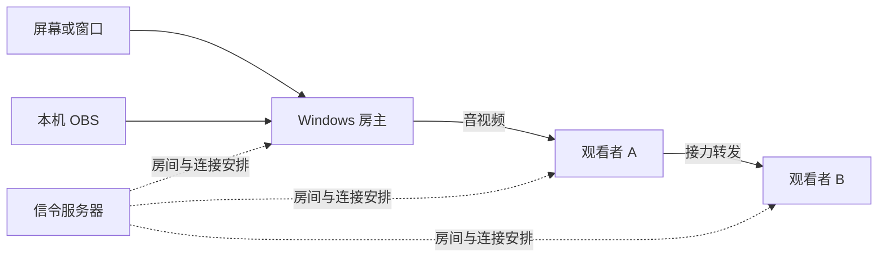
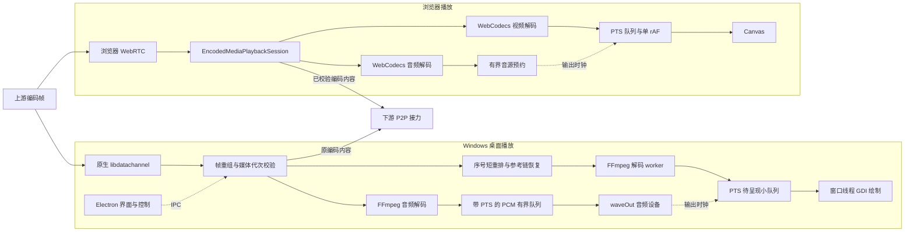

# VDS 项目现状报告

日期：2026-10-08。当前源码版本：1.7.2。VDS 是 Windows 房主与桌面、浏览器观看者之间的多人屏幕共享工具，支持观看者继续接力转发。本轮集中恢复连接与播放、整理关键职责并更新依赖。增强 ICE、源时间与换源隔离、两种播放器的轻量调度已落地；发布前后检查、原生 CTest 15/15、Web 行为回归 125/125、实际 1080p30/60 与零音量八阶段恢复、本地安装包一致性和实际启动均通过。保持纯 P2P，禁止 TURN。1.7.2 安装包已构建验证，正在发布；产物未签名，跨运营商实机连通与长时真实音画仍需验收。

## 项目是什么

## 现有服务端恢复进度

2026-10-07 已恢复现有 NAS 上的 `vds-signaling` Docker 容器，部署本轮修复后的服务与完整 Web 产物，运行时更新为 Node 22.23.3 / Alpine 3.24。按用户要求，管理后台直接访问，无需管理令牌；房间会话身份验证仍保留。旧更新清单、安装包及历史 blockmap 的哈希全部保持一致。VDS 容器和对应 FRP 穿透已设置自动启动，其他容器未改动。

内网真实流程和公网严格 HTTPS/WSS 验证均通过建房、两个观看者的直接/接力拓扑、offer/answer/ICE 双向转发、观看者及房主断线恢复、后台免凭据读取拓扑、伪造房间会话令牌拒绝及退出清理。公网 502 和过期证书问题已解决。

原证书已于 2026-09-17 到期。本轮使用 PassNAT 提供的 DNS TXT 验证渠道签发并部署 Let’s Encrypt 新证书，有效期至 2027-01-05 20:16:17（北京时间）。保留原 FRP 路由和证书文件 ACL，重新加载代理后严格证书校验通过；临时挑战服务已停止。管理入口为 `https://boshan.s.3q.hair/admin`，Web 观看入口为 `https://boshan.s.3q.hair/vds_web/`。

已配置每天 04:17 的轻量 DNS 续期任务，剩余超过 21 天时不联网、不重启，进入窗口后复用既有 ACME 账户。NAS 离线自测、未到期检查和实际无操作运行通过；签发失败保留服务、安装后加载失败回滚证书的流程通过模拟验证。实际到期自动续期尚未发生。维护步骤见 [服务端维护说明](SERVER_OPERATIONS.md)。

## 项目是什么

VDS 是一套可自部署的多人屏幕共享工具。房主用 Windows 客户端共享整个屏幕、单个窗口，或接入本机 OBS 的画面；观看者通过房间码或公开房间列表，用桌面客户端或浏览器加入。适合局域网演示、远程排障、软件和游戏测试围观、OBS 预览分发。

它的主要特点是观看者可以继续把画面转发给其他观看者，分担房主的上传带宽。服务器只负责房间、信令和连接关系，不转发媒体。音视频通过客户端之间的 WebRTC DataChannel 传输；接力节点转发已经编码的帧，避免再次编码的开销。实际连接质量仍取决于网络、设备和浏览器能力。

典型链路如下，实际拓扑可以分支，浏览器能否承担转发由能力检测决定。



## 核心模块与职责

| 模块 | 位置 | 职责与技术 |
| --- | --- | --- |
| Windows 桌面客户端 | `desktop/`、`server/public/` | Electron 主进程和 preload 提供窗口、更新、原生进程桥接；renderer 负责界面、房间操作和媒体控制。 |
| 原生媒体引擎 | `media-agent/` | C++ 独立进程，负责 Windows Graphics Capture 采集、FFmpeg 编解码、libdatachannel 传输、音频、接力转发和原生显示窗口。 |
| 信令与管理服务 | `server/` | Node.js、Express、WebSocket 管理房间、重连和转发拓扑，提供公开房间列表、管理后台与桌面更新源。支持 Docker 部署。 |
| 浏览器观看端 | `vds_web/` | TypeScript、Vite、WebCodecs，负责加入房间、接收和解码画面、能力检测、诊断及符合条件的接力转发。 |
| 检查与发布工具 | `scripts/`、`tests/`、`docs/` | 架构边界检查、协议和生命周期回归、原生构建、桌面打包、发布校验及维护文档。 |

原生视频路径支持 H.264/H.265；原生房主音频使用 Opus，OBS 输入使用 AAC。OBS 通过本机 SRT/MPEG-TS 接入，默认地址为 `127.0.0.1`、端口为 `61080`。浏览器最终可用的编解码组合取决于平台探测结果。

仓库已经做过职责拆分，本轮继续小范围整理关键边界。当前维护难点集中在跨进程调用、异步取消、重复停启以及旧连接回调的归属；部分 renderer 仍由传统脚本和共享状态连接各个 controller。

## 播放端结构与本轮整理

桌面和浏览器共用编码帧协议，使用各自平台的解码与输出后端。Electron 负责界面、房间和原生控制；C++ 负责桌面实际播放。浏览器用 WebCodecs 解码和 Canvas 呈现。两端以源 PTS 决定显示时机，在有效音频启动后参照音频输出位置。



播放会话拥有帧重组、媒体源代次、短乱序和两个播放器的生命周期。`main.ts` 保留房间、信令、上游恢复和编码接力。退出或换源时清理旧解码器、队列、音源和时钟；迟到的旧回调不能复活播放，Web 换源保留已由用户手势解锁的 AudioContext。已校验编码内容的接力继续独立于本地显示丢帧和解码恢复。

| 边界 | 位置 | 当前职责 |
| --- | --- | --- |
| 连接与拓扑 | Web `main.ts`、`upstream-recovery.ts`，桌面 room/peer controller | 连接身份、加入取消、上游恢复与接力握手。 |
| 源时间与代次 | 原生 host clock、OBS ingest、frame timing；两端协议与 relay | 同一源共用 64 位微秒 PTS，v1 可选 `sourceEpoch` 隔离 retained peer 上的换源。下游每次绑定与上游换代生成新的输出代次，PTS、内容序号继续保留。 |
| Web 播放会话 | `vds_web/src/playback-session.ts`、`playback-policy.ts` | 帧重组、代次校验、按发送序号短重排、参考链恢复和统一清理。 |
| 原生视频 | `native_video_surface.cpp`、`native_playback_scheduler.h` | 解码和调度 worker 与窗口绘制分离；压缩队列随源帧率、250 ms 突发窗口和实际音频领先量伸缩，约 20 ms 缺口等待。失效参考链用配置和关键帧恢复。 |
| Web 视频 | `webcodecs-player.ts` | 分别计量待处理输入、codec 内部输出和待呈现画面；根据真实 B 帧重排量预留输出位置，单 rAF 按 PTS 绘制。manifest 的 `frameRate` 与 `fps` 均能传递源帧率，未声明时由实际帧间隔估计。 |
| 音频与输出时钟 | Web audio player；原生 audio session、playback、timing | 预约和 PCM 队列有界，跟踪实际输出位置，驱动视频；没有有效音频时钟时回退单调时钟。 |

待呈现画面保持小队列：原生通常 2 帧，Web 通常 2 帧、观察到 B 帧后通常 3 帧；按 BGRA 尺寸估算的 32 MiB 是软目标，4K 通常只保留 1 帧待呈现，合法的单幅大画面仍可播放。该目标不包含解码器、当前显示画面或 GDI backbuffer。原生尽量在硬件回读和颜色转换前丢弃迟到画面，并移交和复用显示缓冲；Web 及时关闭淘汰的 VideoFrame。待呈现队列满时先等待输出，不裁剪正常参考帧来腾位置。没有新画面时保持上一帧。

两端压缩输入容量随实际源帧率和音频输出进度调整，容纳约 250 ms 的正常聚包及音频领先量。原生压缩队列另计 32 MiB 内存预算和已经到期的 500 ms 陈旧输入，防止持续异常积压；不以固定帧数限制正常 60 fps 或更高帧率。源切换退役记录跟随接收会话生命周期保留，换源次数和刷新请求中的 peer 数量没有新增固定上限。

原生音频把 waveOut 实际采样位置映射到源 PTS，设备在途目标为 60 ms，软件与设备总积压目标为 120 ms 加用户延迟。已有 worker 按 AAC ADTS access unit 或短 PCMU 片段逐段解码，尚未到期的尾段留在原压缩块中，不一次性挤入 PCM。8 kHz AAC 单帧长达 128 ms 等合法格式可临时突破软件软目标，消费后恢复目标；已有 libswresample 转换非 48 kHz 双声道，正常格式直接输出。500 ms 清理只针对已经到期且输出设备确实没有继续前进的数据。Web 同样按完整合法音频单元的实际时长等待，不用 120 ms 目标拒绝低采样率音频；AAC 播放时钟采用可信输入 PTS，兼容 Chrome 解码输出在源时间出现间隙后仍连续计数。未增加音频线程、AudioWorklet、DSP 或长期变速系统。

Web 的 SRT 重连积压恢复只在同 codec、已配置且正在运行的会话中接住较新的 PTS/序号，取消旧待提交尾部后重新锚定，正常 235 ms 聚包继续完整消费。已确认的 B 帧在等待画面按 PTS 呈现时暂停 codec 工作停滞计时；恢复提交后真实无输出仍触发恢复。用户把音量调为零时，Web 视频改用既有单调时钟，不重建 AudioContext、解码器或音源；恢复音量后接回当前音频输出位置。

关键帧请求已经贯通真实 DataChannel 控制通路，按当前连接和 manifest 身份校验并以 500 ms 合并节流。桌面通过已有原生控制调用唤醒房主刷新；WGC/FFmpeg 房主以现有软刷新重启路径生成新配置与 IDR，OBS 等待外部编码器的下一个 IDR。首次 bootstrap 等待期间不反复重启房主。

Web 诊断区分连接、播放和 decoder 状态，同时记录解码队列、待呈现帧、实际呈现、丢弃、音源预约与时钟有效性；计数实时累计，JSON 和 DOM 最多更新 4 Hz。原生诊断同样区分解码输出和 GDI 绘制。`playing` 表示会话已输出过画面，不保证音频或后续帧持续正常；GDI 与 Canvas 计数不代表物理屏幕 Vsync。

WGC 使用实际捕获 QPC；其他 FFmpeg Annex B 与当前 WASAPI 入口仍包含源时间估计。隐藏窗口 GDI、静音播放和设备位置估计不能证明真实音画精度。实施细节、基线和待验收指标见 [播放稳帧改造与验收](PLAYBACK_STABILITY_PLAN.md)。

## 纯 P2P 连接恢复

原来的原生端只使用固定两个 STUN，忽略服务器配置；libjuice 对多个服务器的处理还可能随机选中当前网络不可达的节点。本轮把服务器的纯 STUN 池传到桌面端，先探测可达性，再把首选服务排在最前，与最多四个 STUN 一并传入原生 ICE。Electron 的探测负责选优，NAT 映射采样由真正承载媒体的 libjuice UDP socket 发出，避免用另一条探测 socket 的映射误判媒体端口。

增强打洞由项目自行实现，没有移植 UU 引擎。改动集中在独立端口算法、libjuice/libdatachannel 的受控补丁，以及原有候选交换和生命周期边界，没有新增媒体传输协议或独立的 UDP 媒体栈。

| 环节 | 当前实现 | 条件与限制 |
| --- | --- | --- |
| 多端点采样 | 同一 ICE UDP socket 使用最多四个 STUN URL，每个 URL 最多解析两个地址；按 IPv4 请求首次成功发送的次序记录有效映射 | 去重解析后的服务地址；响应必须匹配事务和来源。至少三个连续有效、同一映射 IPv4 地址的样本才能确认线性步长，增加域名数量不等于增加独立样本。 |
| 端口预测 | 连续样本的非零步长一致且绝对值不超过 16 时，预测后续分配端口并加入邻近端口 | 不稳定样本不做线性外推；端口越界、重复、已观察端口均剔除。 |
| 多端口打洞 | 未确认线性分配时，对最多四个已验证映射端口的 ±1、±2 邻域做有限尝试 | 每个 peer 最多发布 16 个低优先级推测候选；已确认稳定映射不做此类尝试。不能穷举任意随机 NAT。 |
| 检查时序 | 先完成本地采样再发布映射与推测候选；远端线性特征有效时优先检查推测端口，分批候选保留一次短暂等待 | 避免普通检查提前消耗预测窗口；等待有界，不随后续候选反复延长。 |
| 真正建立连接 | 推测端口沿既有信令作为 ICE 候选交换，由实际 ICE socket 执行带当前凭据的连通检查 | 推测候选只有通过真实 ICE 检查才能承载 DataChannel。选中可用候选对后停止其余推测检查；关闭 peer 时释放检查。 |
| 会话归属 | 原生 transport 有独立 `transportGeneration`，推测候选必须携带当前 ICE `ufrag` | 当前控制链路按预期代次拒绝同 ID 旧 peer 的候选、描述、状态和关闭请求；等待远端 SDP 的候选在应用前重新核验连接身份。普通请求仍兼容旧版缺少代次或候选 ufrag 的格式。 |

诊断新增 `stunServers`、`natTraversalEnabled`、`natProbeObservations`、`natPortStep`、`predictedLocalCandidates`、`predictedRemoteCandidates` 和 `transportGeneration`，保留 `selectedStunServer` 及选中候选对。`natPortStep=0` 表示没有确认线性步长，不能把有限邻域尝试解释成线性预测成功。原生默认池已扩为四个 STUN；仅配两个端点时仍支持普通 ICE 和有限邻域尝试，完整线性采样需要至少三个不同、可达的 IPv4 STUN 端点。

`natProbeObservations` 读取底层有效 IPv4 映射样本数，相同映射的多次有效采样也计入，避免候选去重使诊断低估采样数量。

原生依赖固定为 libjuice 1.7.0 和 libdatachannel 0.24.1；补丁作为源码保存在 `media-agent/third_party/ice-patches/`。构建脚本校验上游源包哈希和补丁版本，生成增强依赖，并优先打包配套的 `juice.dll`、`datachannel.dll`，避免只改本机 vcpkg 缓存或混用旧 DLL。

此前本机网络实际选择 Linphone，耗时约 232 ms；这只表示该网络当时可达，不构成跨运营商的通用推荐。配置保持拒绝 TURN；全部探测超时时仍允许局域网 host 候选尝试。浏览器 WebRTC 不提供直接控制其 UDP socket 的接口，Web 端可以接收原生端推测候选，其打洞时序仍由浏览器 ICE 决定。

路由器直连映射已修正 PCP 源地址及响应关联校验，NAT-PMP/PCP 按候选网卡地址和端口去重、匹配网关，并进行有界并发请求。旧映射回包不能污染替代 peer。协议报文和本机 UDP 接线已通过回归，尚未在真实路由器上验证映射成功。

当前 libjuice 1.7.0 仅提供 TCP active，两个原生端不能据此组成 TCP 直连候选对，因此还没有可用的原生端之间 TCP 备用通道。UU 远程本机 `streamer.dll` 的只读静态诊断标记显示 NAT 分组、端口预测、随机端口打洞与 IPv6 相关路径；这些标记不能证明某次连接的实际选路或还原其算法。VDS 本轮实现的是基于有效 STUN 样本的线性预测和有限邻域多端口检查。现有普通候选交换保留 IPv6、TCP、prflx 和 mDNS，不应误认为这些候选全部已验证可用。

UDP 端口预测的适用条件见 [RFC 5128](https://www.rfc-editor.org/rfc/rfc5128.html)，ICE 连通检查见 [RFC 8445](https://www.rfc-editor.org/rfc/rfc8445.html)。PCP 契约见 [RFC 6887](https://www.rfc-editor.org/rfc/rfc6887.html#section-16.4)，TCP active 能力见 [libjuice 1.7.0 源码](https://github.com/paullouisageneau/libjuice/blob/v1.7.0/src/agent.c)。

## 当前可用程度

当前具备完整产品链路，可以继续开发和本地试用。原生 Release 与 15 项 CTest、统一 `npm run check`、Web 125 项行为回归已通过，覆盖真实解码、聚包背压、合法低采样率音频和生命周期恢复。实际房间与 Web 页面完成 1080p30 B2、1080p60 B0、独立零音量三套八阶段恢复，本地安装包和打包应用启动退出通过。跨运营商与长时间真实音画仍需实机验收。

| 验证范围 | 本轮结果 | 适用边界 |
| --- | --- | --- |
| 稳帧专项 | 当前原生 Release 与 CTest 15/15 通过，79.65 秒；调度 17591 项、音频 1420 项断言通过，配置缓存修复已纳入 | 隐藏 GDI 计数不代表物理显示或听感。 |
| 架构、日志、Web 类型与协议、移动诊断自检 | 最新源码的统一 `npm run check` 通过，含 Web 类型与 3 个协议、帧、生命周期脚本 | 手机实际观看需真机验证。 |
| 服务端 | 原有测试及新增回归通过，包含 12 项真实 WebSocket 重连回归 | 已验证容量配置、relay 重绑、页面刷新重新握手、换上游确认和非法消息限流。 |
| 桌面生命周期与 NAT | 88/88 回归通过 | 含当前 host 刷新唤醒、请求合并和大量 peer；覆盖取消加入、旧 socket/peer/surface、STUN、PCP、多网卡及连接代次。真实路由器另需验收。 |
| Web 解码与恢复 | 125/125 行为回归及 3 个协议、帧、生命周期脚本与 TypeScript 通过，含视频 49 项、音频 45 项；Electron 42 真 H.264、AAC、Opus、8 kHz AAC 与 AAC 源 PTS 间隙播放通过 | 覆盖 B 帧预留与正常等待、60 fps 聚包、SRT 重连音频追赶、用户零音量、close/reopen、旧回调、千次换源、音频解锁和色彩断言。 |
| 增强 ICE | 8 项严格虚拟 NAT 场景通过；标准候选基线失败，四 STUN 预测、100 ms 分批 trickle 和双方按远端地址端口分别映射及过滤的场景建立真实 DataChannel | 成功场景双向传输 4096 字节，步长为 1，每侧实际检查 5 个推测端口。单 STUN 邻域及噪声分配场景实际检查有限端口但未连通；预算外不扩张尝试，关闭后停止发包。未验证实际移动与联通互通。 |
| 原生媒体引擎 | Release、CTest 15/15、原生 NAT 合约与 runtime 完整性检查通过 | 含既有 NAT/RPC；源代次通过 8251 项断言，原生 2048 次换源仍拒绝最旧源；真实 DataChannel 关键帧控制通过 210 项断言。 |
| 原生至 Web 播放 | 1080p30 B2、1080p60 B0、零音量 1080p30 B2 均通过全部八阶段：初播、稳定播放、退出重进、刷新、Web 二跳、同 peer 两次源重启、relay 离线后重接房主 | 实际 SRT、房间服务和 Web 页面，稳态吞吐与换源恢复分别检查；零音量场景证实视频使用单调时钟回退。 |
| 1080p30 B2 稳定播放 | 30.201 秒呈现 901 帧，29.833 fps；消费 1409 AAC，46.654 单元/秒；期间视频、音频均无新增丢弃 | 每秒采样峰值：ready 3 帧、压缩待处理 9 帧、decoderQueue 0、BGRA 估算 25,067,520 字节；滚动 128 样本的迟到 P95 最大采样值 13.035 ms。 |
| 1080p60 B0 稳定播放 | 30.146 秒呈现 1781 帧，59.079 fps；消费 1394 AAC，46.242 单元/秒；音频无新增丢弃，视频新增 5 次迟到呈现丢弃 | 每秒采样峰值：ready 2 帧、压缩待处理 17 帧、decoderQueue 0、BGRA 估算 16,711,680 字节；滚动 128 样本迟到 P95 最大采样值 14.518 ms，记录最大迟到 42.866 ms。 |
| 用户零音量播放 | 1080p30 B2 持续 30.001 秒呈现 895 帧，29.832 fps；消费 1397 AAC，期间视频和音频均无新增丢弃 | `audioClockValid=false`，确认静音时不被无效音频主钟拖慢；不代表物理输出或全零音频源验收。 |
| Electron 42 | 当前打包应用实际启动退出通过，Electron 42.11.11、版本 1.7.2 | packaged preload/native API、增强 NAT、四 STUN 含 IPv6、transport 代次与关闭、13 项捕获枚举及音频平台可用；正常退出，无残留测试进程或诊断异常。 |
| Windows 安装包 | 当前 NSIS 构建与完整性通过，239,871,320 字节 | 35 个源码/静态资源与 ASAR 精确一致；Agent/juice/datachannel 三文件匹配 build/runtime/package，latest.yml SHA512 与 blockmap 验证通过。安装向导流程需另行验收。 |

原生真实聚包专项中，同批约 235 ms 的 14 个视频帧与 11 个 AAC 单元连续输入，280 个视频帧全部解码、265 个 GDI 绘制，220 个 AAC 单元全部消费，压缩帧、音频预算丢弃及参考链重置均为 0，峰值压缩输入 16 帧、待呈现 2 帧。正常 60 fps 连续输入绘制 119/120 帧；延迟追加 120 ms、200 ms 后分别绘制 55/60、57/60 帧。音频专项的 110 个 AAC 单元全部消费，低采样率长单元、多 ADTS 单块及长 PCMU 不再被固定队列裁掉。当前 runtime SHA256 为 `94AF26910AEB58103B13B5991B6F858A9E39FF834706D930613CE0047382ABC1`。这些结果验证短突发与合法格式；隐藏窗口和静音测试不能替代实际 WGC/GPU、手机、物理 Vsync、听感或长期音画偏差验收。

上述队列和内存峰值来自每秒采样，不是运行全过程的最大值；两套测试使用同一原生 runtime。源重启时主动丢弃旧音频积压以追赶新源，30 fps 两次分别丢 24 个 AAC 单元，60 fps 分别丢 48、24 个，不能把稳态零音频丢弃扩大到所有恢复阶段。

新版 Web E2E 使用 60 fps offscreen 呈现、音频图音量 100% 与 webContents 静音，保留音频排程和输出时钟。浏览器静音仍可能使用软件虚拟输出，这些结果不证明物理设备实际听到的音画偏差。旧隐藏窗口即时绘制基线与该环境不同，不用于宣称 CPU 或内存下降。

最终 Electron 42 真解码测试分别消费 H.264 3 帧、AAC 9 块、Opus 9 块、8 kHz AAC 6 块、带源 PTS 间隙 AAC 9 块，各项无丢弃，画布色彩断言通过。运行环境为 Electron 42.11.11、Chrome 148.0.7778.280。

本地安装包为 [VDS-Setup-1.7.2.exe](../dist/VDS-Setup-1.7.2.exe)，239,871,320 字节，约 229 MiB，包含当前稳帧与增强 ICE。SHA256 为 `62E5BBAEBED840A654CBA841060DEF9F395171FE321F996D6240F67BE78192CB`。使用 `npm run build -- --publish never` 构建，发布前后检查、35 个源码/静态文件、原生 runtime、安装包 manifest 和实际打包程序启动退出均已核验，当前处于发布准备阶段。NAS 信令和 Web 服务已更新为 1.7.2，管理后台继续免管理令牌。

2026-10-08 完整发布前复验的原生 CTest 为 15/15，79.71 秒。实时呈现用例首次出现 249/280 帧绘制、未达 90% 门槛；隔离复查为 257/280，随后完整门禁通过，未降低断言。该项使用真实 waveOut 时钟和隐藏窗口绘制，受 Windows 调度影响；不能替代物理显示、听感和长时音画验收。

## 本轮修改

本轮保留原目录与媒体协议，处理关键生命周期、连接、播放问题，并自行补充增强 ICE；详细记录见 [代码审计问题清单](CODE_AUDIT_FINDINGS.md)。

- **服务端稳定与会话**：超大 WebSocket 消息只关闭违规连接；观看者可在同一连接换房；后台只读免管理令牌，快照不泄漏房间会话令牌。恢复流程正确透传下游容量，relay 重绑唤醒等待者，刷新和换上游重新握手，非法消息纳入限流。
- **桌面与原生停启**：共享进程启动握手并隔离旧回调；取消加入、surface attach/recover 和 NAT 映射均核验当前会话身份。OBS 清理失败仍重置本地状态；FFmpeg 音频 packet 补充零填充，空包不再永久 flush decoder，waveOut 在途音频计入总积压目标，合法长音频单元按实际时长消费。
- **浏览器连接与解码**：旧 socket/peer 和待播任务无法影响新会话；帧校验覆盖完整帧上限、分片实际长度和元数据一致性。两个解码器隔离过期能力探测、有界顺序处理初帧并恢复失效实例；上游失败、DataChannel 关闭和握手超时可触发恢复。
- **轻量稳帧**：统一源 PTS 和媒体代次，修正 OBS 时间换算；原生解码移入 worker，两端按 PTS 呈现并保护参考链；视频参照有效音频输出，输入容量随源帧率与实际领先量调整，合法音频按单元消费，诊断以 4 Hz 汇总。既有后端和编码内容接力保留，不新增固定帧率、分辨率、换源次数或运行时长限制。
- **纯 P2P 与播放职责**：首选 STUN 与最多四个服务传入原生 ICE，同一媒体 socket 采样、端口预测和有限多端口检查；候选与 transport 代次隔离，修复 PCP 和多网卡映射。Web 收束播放会话，独立记录播放诊断，保留原编码帧接力。
- **依赖与维护入口**：升级 Electron 到 42.11.11，更新 Express、ws、Vite、更新器等依赖，使用 `@electron/rebuild` 替代废弃包；统一常规检查命令，并把新增回归接入发布检查。

当前开发环境要求 Node.js 22.12 或更高版本。锁文件中的主要版本为 Electron 42.11.11、electron-builder 26.17.0、Express 4.22.3、ws 8.22.0、Vite 8.3.3。

根目录和 `server/` 的生产依赖审计均为 0 项告警。根目录全量审计由 36 项降为 8 项 moderate，没有 high/critical；剩余项集中在构建工具的 `@electron/get → global-agent → roarr → sprintf-js` 依赖链。未通过强制降级或覆盖上游版本消除告警。

## 仍需优先处理的部分

详细证据和位置见 [代码审计问题清单](CODE_AUDIT_FINDINGS.md) 顶部的本轮记录。历史条目保留用于追踪，不等同于全部重新复核。

| 优先级 | 剩余问题 | 对使用的影响与下一步 |
| --- | --- | --- |
| 高 | 真实移动宽带与联通宽带互连 | 在两端记录候选类型、选中候选对、STUN 可达性及失败阶段；本机回环验证不能解释跨运营商故障。 |
| 高 | 增强 ICE 在真实 NAT 下的成功率 | 依据两端的采样、步长、候选对和检查时序调整有限预算；任意随机分配、UDP 被阻断等场景仍可能失败。当前 TCP active 不能充当原生双端备用通道，继续禁止 TURN。 |
| 中 | 同房间快速重进缺少 request ID | 迟到确认不能精确归属某次加入；当前保守避免清理新会话，后续可在协议中加入请求标识。 |
| 中 | 媒体时钟与抖动验收 | 共享源时钟、有界缓冲与输出时钟已接入；对网络抖动、OBS 断流重推和长时间真实音画进行测量，根据实际漂移决定是否需要采集硬件时间戳或微量变速。 |
| 中 | 真实设备播放 | 验证 WGC、GPU/跨屏 surface、手机浏览器及音频听感；已有短时合成媒体验证不能覆盖这些场景。 |

后续优先完成跨运营商失败样本和真实设备验收，围绕连接与媒体时序修补；架构整理保持在当前播放会话边界内。

## 维护入口

```powershell
npm install
npm run check
npm run check:dependencies
npm run test:server-reconnect
npm run verify:nat
npm run verify:playback
npm run dev:dual:native
npm run dev:dual:web
```

原生编译还需要 Visual Studio C++ 工具链、FFmpeg SDK 和 vcpkg 提供的基础依赖。`npm run build:media-agent` 会按固定源包和仓库补丁重建增强 ICE，相关流程见 [原生引擎构建说明](../media-agent/README.md)。本地桌面打包可使用 `npm run build -- --publish never`；打包前需准备 Web 构建输出与原生 runtime。`npm run build:release` 包含 GitHub 发布动作，应在完成验收、调整发布版本后使用。

产品和操作说明见 [README](../README.md)，目录职责见 [项目结构](PROJECT_STRUCTURE.md)，本轮变更与媒体架构见 [媒体重构计划](../MEDIA_REFACTOR_PLAN.md)，手机验收见 [移动 Web QA](WEB_MOBILE_DEVICE_QA.md)。
